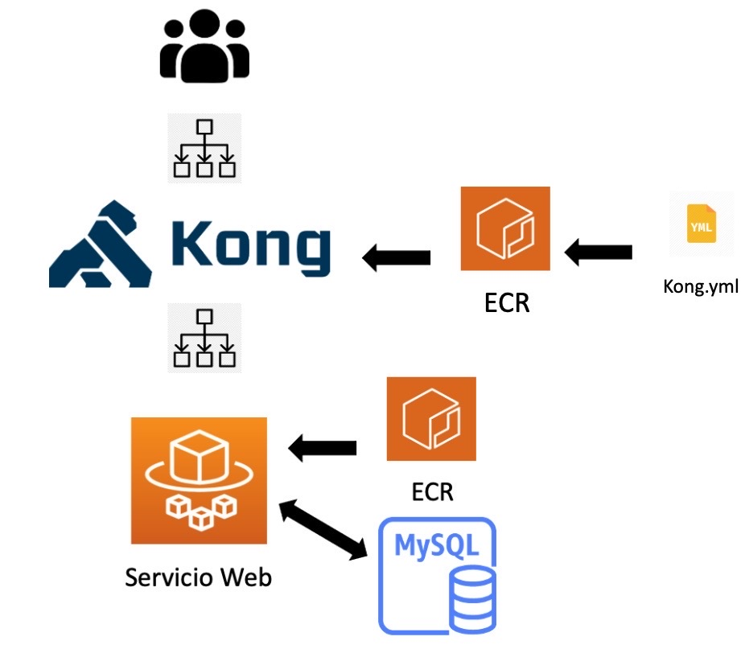

# ARQUITECTURA DE NUESTRO SERVICIO EN AWS
Nuestra aplicación requiere montar dos servicios ECS: uno para kong y otro para el servicio web. Por lo tanto, van a tener sus respectivos balanceadores de carga (ELB), cluster de máquinas, tareas e imagen de docker. Tal como se observa en la imagen, el servicio de kong se comunica con el de la web. Otro aspecto a tener encuenta, es que vamos a necesitar una base de datos para almacenar las votaciones. Para ello, se empleará el servicio RDS y este se comunicará con el servicio ECS del servicio web:

Debido a la sencillez de nuestro proyecto, para levantar Kong lo haremos a través de un archivo de configuración. Así evitaremos levantar una instancia RDS de postgres en aws y ahorrar costes. Para poder levantar el servicio de Kong, se necesita saber cual será el dns del servicio de la web. Como este proyecto se ha realizado sobre una cuenta de aws académica, no se ha podido crear un dominio a través del servicio routes 53 (no tenemos permisos). Es por eso que se ha decidido trabajar en terraform a través de una estructura de módulos, situados en el directorio modules. Dichos modulos se ejecutan en providers.tf:

- Primero se ejecuta el módulo `my_service`. Este módulo se encarga de de crear los recursos para levantar el servicio de la web junto con la base de datos.
- Después se ejecuta el módulo `config_kong`. Este módulo crea el fichero yml de la configuración de kong en local y lo guarda en ECRKong. Tambien crea su repositorio en aws.
- El tercer paso es subir la imagen de kong a un repositorio ECR. En el makefile que se proporciona, si se ejecuta `make push-kong`, se sube la imagen al repositorio ECR.
- Finalmente, se ejecuta el modulo `kong`. Este módulo se encarga de de crear los recursos para levantar el servicio de kong.

Antes de ejecutar estos 4 pasos, hay que realizar un paso previo. Dicho paso es subir la imagen de la app a un repositorio ECR en AWS. Posteriormente, se levantará el resto de la infraestructura. Para la ejecución de estos 4 pasos se ha creado un Makefile. 

A continuación, se van a detallar los pasos a seguir para levantar toda la infraestructura:

## PRERREQUISITOS
Primero hay que instalarse AWS CLI en nuestro ordenador. Es una herramienta de código abierto que nos permite interactuar con los servicios de AWS desde la terminal. También, será necesaria la intalación de terraform. Para poder acceder a nuestra cuenta de aws, hay que colocar las credenciales en el siguiente directorio: ~/.aws/credentials.

## PASO 1 - SUBIR IMÁGENES AL REPOSITORIO ECR EN AWS
Previamente, hay que acceder a la cuenta de aws y en el servicio ECR crear un repositorio. La imagen que se va a subir al repositorio es el Dockerfile que aparece en proyectoVotacionTerraform/ECRServiceWeb. 

Para crear la imagen Dockerfile en docker, hay que iniciar nuestra cuenta de docker y posteriormente, ejecutar este comando: "docker build -t -nombreImagen- .".

Se ha creado el script pushContainer.sh para automatizar la subida. Dentro del archivo tenemos que especificar estas 4 variables:

- ACCOUNT_ID: Tu id de la cuenta de aws.
- AWS_DEFAULT_REGION: La región en la que está ubicada tu cuenta.
- IMAGE_DOCKER_NAME: nombre de tu imagen docker.
- IMAGE_REPO_NAME: nombre de tu repositorio ECR en aws.

Posteriormente, se le dan permisos al script con el siguiente comando en la terminal: chmod +x pushContainer.sh. Para finalizar, ejecutamos ./pushContainer.sh.

## PASO 2 - DESPLEGAR INFRAESTRUCTURA EN AWS USANDO TERRAFORM
Una vez realizado el paso anterior, es necesario modificar ciertas partes del fichero variables.tf para que terraform sepa donde tiene que crear, modificar o destruir los recursos en aws. Para ello, se especificarán los siguientes valores:

- region = región donde está ubicada la cuenta de aws.
- profile = perfil de nuestra cuenta.
- shared_credentials_file = "~/.aws/credentials".

En provider.tf se encuentran toda la infraestructura y recursos que queremos crear en nuestra cuenta de aws. En el modulo my_service, es necesario especificarle la ruta donde se encuentra el repositorio creado en el paso 1 y también la ruta donde se encuentra el rol. 

Después de realizar estos cambios, ya se puede desplegar la infraestructura en aws. Para ello se ejecutará el siguiente comando: `make`

Dentro del makefile tambien se han definido mas reglas por si se quieren generar o eliminar algunos recursos y asi no montar toda la infraestructura.
Se han definido 10 objetivos:

- `make init`: Inicializa el directorio de trabajo y crea el fichero de estado.
- `make plan`: Compara el estado actual, guardado en el fichero de estado, con el código e indica los cambios que deben realizarse. 
- `make all`: Levanta toda la infraestructura.
- `make destroy-all`: Elimina todos los recursos que se han creado.
- `make destroy`: Elimina todos los recursos que se han creado. Pero no se aplica la regla delete-image-kong-ecr.
- `make delete-image-kong-ecr`: Elimina la imagen de kong que se ha subido al repositorio ECR.
- `make service-web-db`: Levanta solamente el modulo que crea recursos de la web y la base de datos.
- `make config-kong`:  Levanta solamente el modulo que crea el fichero yml de la configuración de kong y lo guarda en ECRKong. Tambien crea su repositorio en aws.
- `make service-kong`: Levanta solamente el modulo que crea recursos de kong.
- `make push-kong`: Sube una imagen de kong a un repositorio ECR en aws. Importante tener arrancado docker.

# BORRAR CONTENEDORES E IMAGENES GENERADOS POR DOCKER
En el siguiente enlace puedes obtener un makefile para el borrado de contenedores e imágenes : [Makefile](https://gitlab.com/gesti-n-de-tecnolog-as-inform-ticas/proyecto-votacion/-/blob/main/proyectoVotacion/Makefile)
